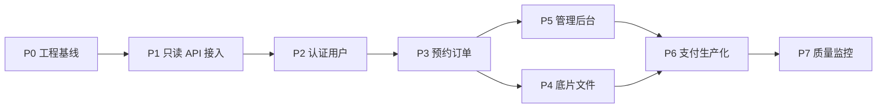

# 琥珀映画项目分层分阶段落地实施计划

## 1. 制定依据

本计划基于当前已完成的项目建设规划和本地工程现状拆解：

- 总体规划已覆盖当前项目现状、优化目标、总体架构、后端服务、数据库设计、前后端对接和实施流程：`docs/overall-optimization-backend-db-plan.md:3`、`docs/overall-optimization-backend-db-plan.md:28`、`docs/overall-optimization-backend-db-plan.md:43`、`docs/overall-optimization-backend-db-plan.md:116`、`docs/overall-optimization-backend-db-plan.md:211`、`docs/overall-optimization-backend-db-plan.md:371`、`docs/overall-optimization-backend-db-plan.md:455`。
- 本地后端已经具备基础 API、H2 数据库、Flyway 迁移、核心预约订单链路：`docs/backend-local-runbook.md:3`。
- 仍需生产化的内容包括短信/微信登录、支付、对象存储、标准鉴权、管理后台等：`docs/backend-local-runbook.md:207`。

## 2. 分层建设任务

### 2.1 产品与业务层

目标：把“摄影预约演示项目”收敛为真实可运营的业务闭环。

核心任务：

- 明确用户端主链路：浏览套餐 -> 选择门店 -> 选择档期 -> 登录/实名 -> 提交预约 -> 支付 -> 查看订单 -> 查看底片。
- 明确运营后台链路：管理套餐 -> 管理门店 -> 配置档期 -> 处理订单 -> 上传底片 -> 查看运营数据。
- 明确状态规则：订单状态、支付状态、档期状态、底片可见状态。
- 明确边界规则：用户只能访问自己的订单和底片，管理员按角色操作。

核心重点：

- 先打通主链路，再完善运营能力。
- 所有状态变化必须以后端数据库为准，前端只做展示和交互。
- 涉及支付、实名、底片下载的能力要提前预留合规和权限控制。

### 2.2 前端应用层

目标：保留当前 Taro 多端能力，将本地 mock 数据逐步替换为后端 API。

核心任务：

- 新增 `client/src/api` 请求层，统一 baseURL、token、错误处理、loading 和 401 跳转。
- 新增 API 类型定义，降低页面对后端字段的直接耦合。
- 替换服务、门店、档期、订单、用户、底片的数据来源。
- 补齐接口加载态、空态、错误态、重试入口。
- 保留 Zustand，但将其定位为登录态、临时预约草稿和轻量缓存。

核心重点：

- 先接只读接口，再接写接口。
- 每替换一个模块都要保留回滚点，避免一次性大改全站。
- 前端字段适配集中放在 API 层，不要散落到页面组件里。

### 2.3 后端服务层

目标：提供稳定 REST API，承载认证、服务、门店、档期、订单、底片等业务。

核心任务：

- 完善当前 Spring Boot 后端工程结构。
- 将开发态登录升级为真实短信/微信登录。
- 将订单支付从 mock 升级为微信支付服务端流程。
- 增加后台管理 API。
- 增加统一错误码、日志、审计、接口权限、参数校验。
- 补充单元测试和接口测试。

核心重点：

- 预约创建、支付回调、取消订单必须有事务边界和幂等处理。
- 订单状态流转只能在后端控制。
- 所有用户私有数据接口必须校验当前登录用户。

### 2.4 数据库与存储层

目标：建立可迁移、可约束、可审计的数据体系。

核心任务：

- 用 Flyway 管理数据库结构和种子数据。
- 将 H2 开发数据库迁移到 MySQL 生产数据库。
- 建立用户、套餐、门店、档期、订单、支付、底片、文件、操作日志表。
- 引入对象存储保存套餐图、门店图、底片图。
- 设计备份、恢复、数据初始化和测试数据隔离策略。

核心重点：

- 档期容量必须通过数据库事务约束，不能只靠前端判断。
- 支付和订单数据保留审计，不做物理删除。
- 敏感信息不能明文存储，实名信息至少要加密或哈希处理。

### 2.5 运维与质量层

目标：让项目从“能跑”走向“能交付、能定位问题、能持续迭代”。

核心任务：

- 建立本地一键启动环境。
- 增加后端测试、前端冒烟测试、接口契约测试。
- 增加日志 traceId、错误码、慢 SQL 排查能力。
- 配置生产环境变量、HTTPS、跨域、小程序合法域名。
- 制定发布、回滚、数据库迁移流程。

核心重点：

- 所有环境配置走环境变量，不提交密钥。
- 先保证主链路自动化验证，再扩展覆盖面。
- 发布前必须有数据库迁移回滚预案。

## 3. 分阶段实施路线

### 阶段 P0：现状固化与工程基线

目标：把当前已经完成的规划和后端基础工程固定成可继续开发的基线。

当前状态：

- 后端 `server/` 工程已创建。
- H2 + Flyway 已可初始化本地数据库。
- 已实现健康检查、服务、门店、档期、登录、预约、订单、底片列表基础接口。
- 已新增本地联调文档和 API 对接文档。

实施步骤：

1. 确认 `.gitignore` 覆盖运行产物、数据库文件和构建目录。
2. 运行 `mvn test` 确认后端可编译。
3. 启动后端，验证 `/api/health`、`/api/services`、登录、创建预约、支付。
4. 固化文档入口，确认开发成员能按文档启动。

核心重点：

- 不急着接前端，先确保后端基线稳定。
- 数据库迁移脚本要从一开始纳入版本管理。
- 本地 H2 数据库只用于开发，不作为生产方案。

交付物：

- `server/` 后端基础工程。
- `docs/backend-local-runbook.md`
- `docs/api-integration-contract.md`
- `docs/backend-database-schema.sql`

验收标准：

- 新机器按文档能启动后端。
- 主链路接口冒烟成功。
- Git 状态不包含 `server/data`、`server/target` 等运行产物。

### 阶段 P1：前端 API 基础层与只读数据接入

目标：让前端从本地 mock 开始迁移到后端真实接口。

实施步骤：

1. 新增 `client/src/api/request.ts`。
2. 配置开发环境 API 地址，例如 `http://localhost:8080`。
3. 新增 `client/src/api/services.ts`、`client/src/api/stores.ts`。
4. 新增接口 DTO 类型，完成后端字段到前端领域模型的适配。
5. 替换服务列表页的数据源。
6. 替换服务详情页的数据源。
7. 替换门店列表和门店选择数据源。
8. 替换固定时间段为档期接口。

核心重点：

- 优先替换只读接口，风险低、反馈快。
- API 层负责字段转换，页面组件尽量不感知后端字段差异。
- 所有接口都要有 loading、empty、error 三种状态。

交付物：

- 前端统一请求层。
- 服务、门店、档期 API 封装。
- 服务列表、详情、门店选择页面完成真实数据接入。

验收标准：

- 停用 `client/src/data/services.ts` 作为页面主数据源。
- 服务列表和详情刷新后仍能展示。
- 后端服务停止时，前端能给出可理解的错误提示。

### 阶段 P2：认证、用户与实名链路接入

目标：将当前 mock 登录替换为后端登录态。

实施步骤：

1. 前端新增 `client/src/api/auth.ts`。
2. 调用 `POST /api/auth/phone-login` 完成手机号登录。
3. 将 token 存入 Taro Storage。
4. 请求层自动注入 `Authorization`。
5. 调用 `GET /api/users/me` 恢复当前用户。
6. 调用 `POST /api/users/real-name` 保存实名。
7. 调整 `useAuthStore`，保留登录态和用户资料缓存。
8. 未登录访问预约确认、订单、底片时统一跳转登录。

核心重点：

- token 失效时必须统一处理，不能每个页面各写一套。
- 用户资料以服务端为准，本地缓存只做体验优化。
- 实名信息涉及敏感数据，前端不要长期保存证件号。

交付物：

- 登录接口接入。
- 当前用户恢复逻辑。
- 实名接口接入。
- 登录态统一拦截。

验收标准：

- 刷新 H5 页面后仍能恢复登录态。
- 未登录访问受保护页面会跳登录。
- 实名保存后重新进入页面仍能显示服务端数据。

### 阶段 P3：预约与订单主链路接入

目标：完成真实预约闭环，替代本地订单状态。

实施步骤：

1. 前端新增 `client/src/api/orders.ts`。
2. 预约确认页调用 `POST /api/bookings`。
3. 订单列表页调用 `GET /api/orders`。
4. 订单详情页调用 `GET /api/orders/{id}`。
5. 支付按钮调用 `POST /api/orders/{id}/pay`。
6. 取消按钮调用 `POST /api/orders/{id}/cancel`。
7. 完成/核销按钮调用 `POST /api/orders/{id}/complete`。
8. 删除按钮调用 `DELETE /api/orders/{id}`。
9. 移除 `client/src/data/bookings.ts` 对页面的默认注入。

核心重点：

- 创建订单后必须刷新订单列表或更新缓存。
- 支付、取消、完成都以后端返回状态为准。
- 档期满员、状态非法等错误要映射成用户能理解的提示。

交付物：

- 预约确认真实提交。
- 订单列表真实查询。
- 订单状态真实变更。
- 本地订单 mock 退出主流程。

验收标准：

- 创建预约后数据库中有订单记录。
- 同一档期容量达到上限后不能继续预约。
- 支付后订单变为已预约。
- 取消后档期容量释放。

### 阶段 P4：底片、文件与对象存储

目标：把底片从 mock 图片升级为用户私有资源。

实施步骤：

1. 后端新增文件上传凭证接口。
2. 接入 MinIO、腾讯云 COS 或阿里云 OSS。
3. 建立底片上传和订单绑定能力。
4. 前端新增 `client/src/api/negatives.ts`。
5. 底片页调用 `GET /api/negatives`。
6. 下载或预览链接使用短期签名 URL。
7. 增加底片权限校验，用户只能访问自己的底片。

核心重点：

- 原图和精修图要区分类型。
- 下载链接不能永久公开。
- 文件删除和订单审计要分开，避免误删资产。

交付物：

- 对象存储接入。
- 底片列表真实数据接入。
- 文件上传/下载权限控制。

验收标准：

- 用户只能看到自己的底片。
- 未登录无法访问底片接口。
- 底片 URL 过期后不能继续访问。

### 阶段 P5：管理后台与运营配置

目标：让业务数据可由运营维护，而不是写死在代码里。

实施步骤：

1. 明确后台角色：管理员、门店运营、摄影师、客服。
2. 实现管理员登录和角色权限。
3. 实现套餐管理。
4. 实现门店管理。
5. 实现档期管理。
6. 实现订单管理。
7. 实现底片上传和绑定。
8. 增加操作日志。
9. 视复杂度决定独立建设 Web 管理端或先做 Admin API。

核心重点：

- 后台改价格、上下架、调档期都要有审计日志。
- 管理端不能复用用户端 token 权限。
- 订单敏感操作要记录操作者、时间、变更前后状态。

交付物：

- Admin API。
- 管理后台页面或临时运营工具。
- 操作日志表和查询能力。

验收标准：

- 不改前端代码即可新增套餐。
- 不改数据库即可调整门店档期。
- 后台操作可追踪。

### 阶段 P6：支付、合规与生产化

目标：补齐真实交易、登录、隐私与生产部署能力。

实施步骤：

1. 接入微信登录，服务端通过 code 换取 openid。
2. 接入短信平台，替换任意验证码。
3. 接入微信支付，后端创建支付单。
4. 实现支付回调验签、幂等和补偿查询。
5. 敏感配置迁移到环境变量或密钥系统。
6. 配置 HTTPS、域名、小程序合法域名。
7. 接入生产 MySQL 和 Redis。
8. 建立备份与恢复策略。

核心重点：

- 支付成功只能以后端回调验签为准。
- 支付回调必须幂等，不能重复确认订单。
- 生产数据库迁移要先演练再发布。

交付物：

- 真实微信登录。
- 真实短信验证码。
- 真实支付链路。
- 生产环境部署配置。

验收标准：

- 微信支付沙箱或测试商户流程跑通。
- 重复支付回调不会重复改订单。
- 生产配置不包含明文密钥。

### 阶段 P7：质量体系、监控与持续交付

目标：让项目具备长期迭代和问题定位能力。

实施步骤：

1. 后端补单元测试：认证、预约、订单状态。
2. 后端补接口测试：服务、门店、档期、订单。
3. 前端补冒烟测试：服务浏览、登录、预约、订单。
4. 增加接口 traceId。
5. 增加统一业务日志和错误日志。
6. 增加慢 SQL 监控和关键指标。
7. 建立 CI：前端构建、后端测试、后端打包。
8. 建立发布清单和回滚流程。

核心重点：

- 优先覆盖最值钱的主链路测试，不追求一开始测试全覆盖。
- 日志必须能串起一次用户请求。
- 发布前必须能快速确认健康状态和核心接口。

交付物：

- 自动化测试。
- CI 流程。
- 日志和监控规范。
- 发布检查清单。

验收标准：

- 提交代码自动运行后端测试。
- 主链路冒烟可重复执行。
- 生产异常能定位到接口、用户、订单或 traceId。

## 4. 阶段依赖关系

## 5. 工作包拆解

### 5.1 前端工作包

| 工作包 | 内容 | 依赖 | 优先级 |
| --- | --- | --- | --- |
| FE-01 | API 请求层 | P0 | 高 |
| FE-02 | 服务列表/详情接 API | FE-01 | 高 |
| FE-03 | 门店/档期接 API | FE-01 | 高 |
| FE-04 | 登录态改造 | FE-01 | 高 |
| FE-05 | 预约确认接 API | FE-02/03/04 | 高 |
| FE-06 | 订单列表/详情接 API | FE-05 | 高 |
| FE-07 | 底片接 API | FE-04 | 中 |
| FE-08 | 错误态/空态/加载态统一 | FE-01 | 中 |

### 5.2 后端工作包

| 工作包 | 内容 | 依赖 | 优先级 |
| --- | --- | --- | --- |
| BE-01 | 完善接口错误码和响应规范 | P0 | 高 |
| BE-02 | 服务/门店/档期接口增强 | P0 | 高 |
| BE-03 | 真实认证接入 | P2 | 高 |
| BE-04 | 预约并发和状态测试 | P3 | 高 |
| BE-05 | 支付回调与幂等 | P6 | 高 |
| BE-06 | 对象存储接入 | P4 | 中 |
| BE-07 | Admin API | P5 | 中 |
| BE-08 | 日志、审计、traceId | P5/P7 | 中 |

### 5.3 数据库工作包

| 工作包 | 内容 | 依赖 | 优先级 |
| --- | --- | --- | --- |
| DB-01 | Flyway 脚本规范化 | P0 | 高 |
| DB-02 | MySQL 环境迁移验证 | P6 | 高 |
| DB-03 | 订单/支付索引优化 | P3/P6 | 高 |
| DB-04 | 操作日志表完善 | P5 | 中 |
| DB-05 | 备份恢复流程 | P6 | 中 |

### 5.4 运维质量工作包

| 工作包 | 内容 | 依赖 | 优先级 |
| --- | --- | --- | --- |
| OPS-01 | 本地一键启动 | P0 | 中 |
| OPS-02 | 后端测试集 | P3 | 高 |
| OPS-03 | 前端冒烟测试 | P3 | 高 |
| OPS-04 | CI 构建 | P7 | 中 |
| OPS-05 | 发布检查清单 | P6 | 中 |

## 6. 近期三轮迭代建议

### 迭代 1：前端接只读 API

范围：

- 新增前端请求层。
- 接入服务列表、服务详情、门店、档期。
- 保留 mock 作为开发兜底。

完成标志：

- 首页进入预约页后，套餐和门店来自后端。
- 服务详情页可刷新直达。
- 档期来自数据库。

### 迭代 2：接登录和预约订单

范围：

- 接手机号登录。
- token 自动注入。
- 预约确认提交到后端。
- 订单列表和详情来自后端。
- 支付、取消调用后端。

完成标志：

- 用户能完成完整预约闭环。
- Zustand 不再保存订单真源。
- 本地订单 mock 不影响主流程。

### 迭代 3：补底片、后台和生产化预备

范围：

- 底片 API 接入。
- 设计并实现 Admin API 第一版。
- 设计对象存储接入。
- 增加后端接口测试。
- 准备 MySQL/Redis 环境。

完成标志：

- 用户端底片不再使用 mock。
- 运营可通过后台或接口管理基础数据。
- 后端具备主链路测试。

## 7. 风险清单与控制策略

| 风险 | 影响 | 控制策略 |
| --- | --- | --- |
| 前端一次性替换范围过大 | 页面回归成本高 | 按只读、认证、订单、底片分批替换 |
| 档期并发不足 | 超卖预约 | 数据库事务、行锁、容量测试 |
| token 失效处理分散 | 用户体验不一致 | 请求层统一处理 401 |
| 支付回调重复 | 订单状态错乱 | 支付流水唯一键和幂等状态机 |
| 图片资源公开 | 用户隐私风险 | 对象存储私有桶 + 短期签名 URL |
| H2 与 MySQL 方言差异 | 部署后 SQL 出错 | P6 前单独做 MySQL 迁移验证 |
| 缺少后台审计 | 运营问题难追踪 | 管理操作统一写 operation_logs |

## 8. 里程碑验收口径

### M1：后端基线可用

- 后端可启动。
- 数据库自动初始化。
- 服务、门店、档期、登录、预约、订单接口冒烟通过。

### M2：前端只读数据真实化

- 服务、门店、档期来自 API。
- 页面刷新和异常态可用。

### M3：用户预约闭环真实化

- 登录、实名、创建预约、订单查询、支付、取消都走后端。
- 本地 mock 不再作为业务真源。

### M4：运营能力可用

- 管理员可管理套餐、门店、档期、订单、底片。
- 操作可审计。

### M5：生产预备完成

- MySQL、Redis、对象存储、短信、微信支付接入。
- 主链路测试和发布检查清单具备。

## 9. 执行原则

- 主链路优先：先保证用户能真实预约，再做边缘功能。
- 后端为准：订单、支付、档期、底片权限以后端数据库状态为准。
- 小步替换：每次只替换一个数据源或一个业务闭环。
- 可回滚：前端接 API 时保留清晰的错误兜底，后端迁移脚本要可复盘。
- 可验证：每个阶段必须有接口或页面验收方式，不以“代码写完”作为完成标准。

