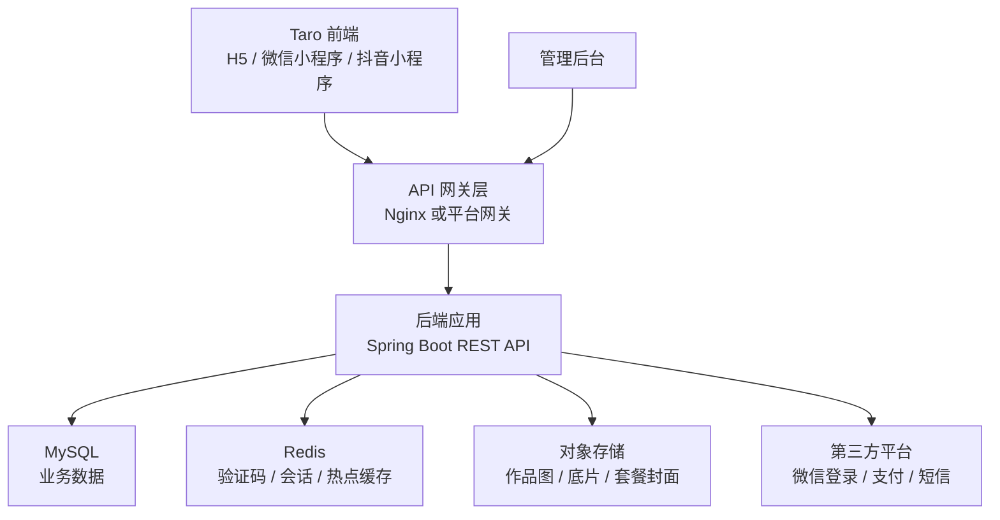

# 琥珀映画项目整体优化与后端数据库建设规划

## 1. 当前项目现状

### 1.1 已验证事实

- 当前项目是 Taro + React + TypeScript + Sass 前端项目，`package.json` 中配置了 Taro H5、微信小程序、抖音、支付宝等多端构建脚本：`package.json:12`。
- Taro 相关依赖版本为 `4.1.9`，React 为 `^18.0.0`，状态管理使用 `zustand`：`package.json:40`、`package.json:53`、`package.json:54`。
- 应用页面包括首页、预约、底片、订单、我的、登录、手机号、验证码、实名、服务详情、预约确认、订单详情、设置、关于：`src/app.config.ts:2`。
- 应用品牌标题为“琥珀映画”，底部 Tab 包括首页、预约、底片、订单、我的：`src/app.config.ts:21`、`src/app.config.ts:24`。
- 前端当前未发现 `Taro.request`、`fetch`、`axios` 等真实后端请求调用；服务、订单、登录状态主要依赖本地数据和本地存储。
- 服务套餐数据来自本地 `serviceList`：`src/data/services.ts:11`。
- 初始订单数据来自本地 `initialBookings`：`src/data/bookings.ts:3`。
- 登录状态使用 Zustand + Taro Storage 持久化：`src/store/useAuthStore.ts:48`。
- 预约订单使用 Zustand + Taro Storage 持久化：`src/store/useBookingStore.ts:75`。
- 预约确认页当前直接调用本地 `createBooking` 创建订单：`src/pages/booking/confirm/index.tsx:112`。
- 订单页当前通过本地 `updateStatus` 和 `removeBooking` 修改订单：`src/pages/orders/index.tsx:176`、`src/pages/orders/index.tsx:201`、`src/pages/orders/index.tsx:211`。

### 1.2 主要问题

- 数据源割裂：服务、门店、订单、底片、用户资料都分散在前端本地 mock 或页面内部常量中，无法多端同步。
- 业务一致性不足：摄影服务数据与初始订单样例存在业务不一致，例如订单 mock 中仍有“肩颈放松”“到家保洁”。
- 缺少后端权限边界：登录、实名、订单、底片等功能目前没有服务端身份校验和数据隔离。
- 缺少数据库约束：订单状态流转、预约档期、防重复下单、底片归属、支付状态等都没有持久化约束。
- 缺少可运维能力：没有 API 日志、错误追踪、接口鉴权、数据库迁移、初始化脚本、环境配置规范。
- 图片资源依赖外部占位图 `picsum.photos`，不适合生产环境。

## 2. 优化目标

### 2.1 产品目标

- 将当前演示版升级为可真实运行的摄影预约系统。
- 支持用户登录、手机号绑定、实名信息、服务浏览、门店选择、档期预约、订单支付状态、底片查看、个人中心。
- 支持后台管理服务套餐、门店、档期、订单、底片和用户信息。

### 2.2 技术目标

- 前端保留 Taro 多端能力，逐步将本地 mock 替换为接口数据。
- 新增后端服务统一提供 REST API。
- 新增关系型数据库承载核心业务数据。
- 建立接口契约、错误码、鉴权、迁移脚本、环境配置和部署流程。

## 3. 总体架构设计

### 3.1 推荐架构



### 3.2 模块划分

- 前端用户端：沿用当前 Taro 项目，负责用户浏览、预约、订单、底片、个人中心。
- 后端 API 服务：负责认证、用户、服务套餐、门店、档期、订单、支付、底片、文件签名、后台管理接口。
- 数据库：保存用户、门店、套餐、档期、订单、底片、支付流水、操作日志等核心数据。
- 管理后台：后续可独立建设 Web 管理端，用于运营配置和订单处理。
- 文件存储：用于服务封面、作品图、底片原图、精修图，不建议直接存入数据库。

## 4. 技术选型

### 4.1 后端

推荐使用 Java 17 + Spring Boot 3.x。

选择依据：

- 当前项目路径位于 Java 课程项目目录，后端使用 Java 技术栈更符合项目上下文。
- Spring Boot 适合快速构建 REST API、鉴权、参数校验、事务、数据库访问和部署。
- 对摄影预约系统这种 CRUD + 状态流转 + 文件资源 + 支付集成的业务复杂度足够稳定。

推荐组件：

- Web 框架：Spring Boot Web
- 数据访问：MyBatis-Plus 或 Spring Data JPA
- 数据库迁移：Flyway
- 参数校验：Hibernate Validator
- 鉴权：Spring Security + JWT
- API 文档：springdoc-openapi
- 缓存：Redis
- 数据库：MySQL 8
- 对象存储：腾讯云 COS、阿里云 OSS 或 MinIO
- 日志：Logback + JSON 日志格式
- 测试：JUnit 5 + Testcontainers 或 H2 单元测试

### 4.2 前端

保留当前 Taro + React + TypeScript + Sass 技术栈。

优化方向：

- 新增统一请求层 `src/api`，封装 `Taro.request`、baseURL、token、错误处理。
- 新增接口类型 `src/types/api.ts`，避免页面直接依赖后端裸结构。
- 将 `src/data/services.ts`、`src/data/bookings.ts` 从默认数据源降级为开发兜底或删除。
- Zustand 保留为前端状态缓存，但订单、用户、服务等以服务端数据为准。
- 页面内写死的门店、活动、作品和底片数据迁移到 API。

### 4.3 数据库

推荐 MySQL 8。

选择依据：

- 订单、用户、门店、服务套餐、档期等数据关系明确，适合关系型数据库。
- 支持事务约束，能保证预约下单、库存/档期扣减、支付状态更新的一致性。
- 对课程项目、演示部署和后续扩展都更直接。

Redis 用于验证码、登录会话、接口限流、热门套餐缓存、预约档期短缓存。

## 5. 后端服务设计

### 5.1 后端目录建议

建议在仓库新增 `server` 目录：

```text
server/
  pom.xml
  src/main/java/com/amberfilm/
    AmberFilmApplication.java
    common/
    config/
    auth/
    user/
    service/
    store/
    schedule/
    booking/
    order/
    payment/
    negative/
    file/
    admin/
  src/main/resources/
    application.yml
    application-dev.yml
    db/migration/
```

### 5.2 后端分层

- Controller：HTTP 入参、登录鉴权、响应包装。
- Service：业务规则、事务边界、状态流转。
- Repository/Mapper：数据库访问。
- DTO：请求与响应对象。
- Entity：数据库实体。
- Common：统一响应、错误码、异常处理、分页对象、审计字段。

### 5.3 核心接口规划

#### 认证与用户

| 方法 | 路径 | 说明 |
| --- | --- | --- |
| POST | `/api/auth/wechat-login` | 微信登录，接入 `code` 换取 openid |
| POST | `/api/auth/sms/send` | 发送短信验证码 |
| POST | `/api/auth/phone-login` | 手机号验证码登录 |
| POST | `/api/auth/logout` | 退出登录 |
| GET | `/api/users/me` | 获取当前用户资料 |
| PATCH | `/api/users/me` | 更新昵称、头像等资料 |
| POST | `/api/users/real-name` | 实名认证信息提交 |

#### 服务与门店

| 方法 | 路径 | 说明 |
| --- | --- | --- |
| GET | `/api/service-categories` | 服务分类列表 |
| GET | `/api/services` | 服务套餐列表，支持分类、关键词、门店过滤 |
| GET | `/api/services/{id}` | 服务详情 |
| GET | `/api/stores` | 门店列表，支持关键词、距离、标签过滤 |
| GET | `/api/stores/{id}` | 门店详情 |
| GET | `/api/stores/{id}/schedules` | 查询门店可预约日期和时段 |

#### 预约与订单

| 方法 | 路径 | 说明 |
| --- | --- | --- |
| POST | `/api/bookings` | 创建预约订单 |
| GET | `/api/orders` | 当前用户订单列表 |
| GET | `/api/orders/{id}` | 订单详情 |
| POST | `/api/orders/{id}/pay` | 发起支付或模拟支付 |
| POST | `/api/orders/{id}/cancel` | 取消订单 |
| POST | `/api/orders/{id}/complete` | 核销或完成订单 |
| DELETE | `/api/orders/{id}` | 删除用户侧订单展示记录，后台仍保留审计 |

#### 底片与文件

| 方法 | 路径 | 说明 |
| --- | --- | --- |
| GET | `/api/negatives` | 当前用户底片列表 |
| GET | `/api/negatives/{id}` | 底片详情 |
| POST | `/api/files/upload-token` | 获取对象存储上传凭证 |
| GET | `/api/files/{id}/download-url` | 获取带权限的下载地址 |

#### 管理后台

| 方法 | 路径 | 说明 |
| --- | --- | --- |
| GET/POST/PATCH | `/api/admin/services` | 套餐管理 |
| GET/POST/PATCH | `/api/admin/stores` | 门店管理 |
| GET/POST/PATCH | `/api/admin/schedules` | 档期管理 |
| GET/PATCH | `/api/admin/orders` | 订单管理 |
| POST | `/api/admin/negatives` | 上传并绑定底片 |

## 6. 数据库设计

### 6.1 核心表

#### users

| 字段 | 类型 | 说明 |
| --- | --- | --- |
| id | bigint pk | 用户 ID |
| openid | varchar(64) unique | 微信 openid |
| phone | varchar(20) unique | 手机号 |
| nickname | varchar(64) | 昵称 |
| avatar_url | varchar(512) | 头像 |
| real_name | varchar(64) | 实名 |
| id_card_hash | varchar(128) | 证件号哈希，不保存明文 |
| status | varchar(20) | normal/disabled |
| created_at | datetime | 创建时间 |
| updated_at | datetime | 更新时间 |

#### service_categories

| 字段 | 类型 | 说明 |
| --- | --- | --- |
| id | bigint pk | 分类 ID |
| code | varchar(32) unique | 分类编码 |
| name | varchar(64) | 分类名称 |
| sort_order | int | 排序 |
| enabled | tinyint | 是否启用 |

#### services

| 字段 | 类型 | 说明 |
| --- | --- | --- |
| id | bigint pk | 套餐 ID |
| category_id | bigint fk | 分类 ID |
| name | varchar(128) | 套餐名称 |
| cover_file_id | bigint | 封面文件 |
| price_cent | int | 价格，单位分 |
| duration_min | int | 服务时长 |
| description | text | 描述 |
| tags_json | json | 标签 |
| rating | decimal(2,1) | 展示评分 |
| enabled | tinyint | 是否上架 |
| created_at | datetime | 创建时间 |
| updated_at | datetime | 更新时间 |

#### stores

| 字段 | 类型 | 说明 |
| --- | --- | --- |
| id | bigint pk | 门店 ID |
| name | varchar(128) | 门店名称 |
| address | varchar(255) | 地址 |
| longitude | decimal(10,6) | 经度 |
| latitude | decimal(10,6) | 纬度 |
| hours | varchar(64) | 营业时间 |
| tags_json | json | 标签 |
| cover_file_id | bigint | 门店封面 |
| enabled | tinyint | 是否启用 |

#### store_service_rel

| 字段 | 类型 | 说明 |
| --- | --- | --- |
| id | bigint pk | 关系 ID |
| store_id | bigint fk | 门店 ID |
| service_id | bigint fk | 套餐 ID |
| enabled | tinyint | 是否可预约 |

#### schedules

| 字段 | 类型 | 说明 |
| --- | --- | --- |
| id | bigint pk | 档期 ID |
| store_id | bigint fk | 门店 ID |
| service_id | bigint fk nullable | 指定套餐，可为空 |
| service_date | date | 日期 |
| start_time | time | 开始时间 |
| end_time | time | 结束时间 |
| capacity | int | 可预约容量 |
| booked_count | int | 已预约数量 |
| status | varchar(20) | available/closed/full |

#### orders

| 字段 | 类型 | 说明 |
| --- | --- | --- |
| id | bigint pk | 订单 ID |
| order_no | varchar(32) unique | 订单号 |
| user_id | bigint fk | 用户 ID |
| service_id | bigint fk | 套餐 ID |
| store_id | bigint fk | 门店 ID |
| schedule_id | bigint fk | 档期 ID |
| contact_name | varchar(64) | 联系人 |
| contact_phone | varchar(20) | 联系电话 |
| price_cent | int | 下单价格 |
| status | varchar(20) | pending/confirmed/completed/cancelled/refunded |
| pay_status | varchar(20) | unpaid/paid/refunded |
| appointment_at | datetime | 预约时间 |
| cancelled_at | datetime | 取消时间 |
| created_at | datetime | 创建时间 |
| updated_at | datetime | 更新时间 |

#### payments

| 字段 | 类型 | 说明 |
| --- | --- | --- |
| id | bigint pk | 支付 ID |
| order_id | bigint fk | 订单 ID |
| channel | varchar(20) | wechat/mock |
| amount_cent | int | 金额 |
| status | varchar(20) | pending/success/failed/refunded |
| transaction_no | varchar(128) | 第三方交易号 |
| paid_at | datetime | 支付时间 |

#### negatives

| 字段 | 类型 | 说明 |
| --- | --- | --- |
| id | bigint pk | 底片 ID |
| user_id | bigint fk | 用户 ID |
| order_id | bigint fk | 订单 ID |
| file_id | bigint fk | 文件 ID |
| title | varchar(128) | 标题 |
| type | varchar(20) | original/retouched |
| status | varchar(20) | visible/hidden |
| created_at | datetime | 创建时间 |

#### files

| 字段 | 类型 | 说明 |
| --- | --- | --- |
| id | bigint pk | 文件 ID |
| storage_provider | varchar(32) | cos/oss/minio |
| bucket | varchar(128) | 存储桶 |
| object_key | varchar(512) | 对象路径 |
| url | varchar(1024) | 公开或 CDN 地址 |
| mime_type | varchar(128) | MIME |
| size_bytes | bigint | 文件大小 |
| created_at | datetime | 创建时间 |

### 6.2 状态流转

订单状态：

```text
pending -> confirmed -> completed
pending -> cancelled
confirmed -> cancelled
confirmed -> refunded
completed -> refunded
```

约束建议：

- 创建订单时必须在事务内锁定对应 `schedules` 记录，确保 `booked_count < capacity`。
- 支付成功后将订单从 `pending` 更新为 `confirmed`，并记录 `payments`。
- 取消订单时释放档期容量，但已完成订单默认不允许普通用户取消。
- 删除订单只做用户侧隐藏或软删除，不应物理删除订单和支付数据。

## 7. 前后端功能对接规划

### 7.1 新增前端 API 层

建议新增：

```text
src/api/
  request.ts
  auth.ts
  services.ts
  stores.ts
  schedules.ts
  orders.ts
  negatives.ts
src/types/api.ts
```

`request.ts` 职责：

- 读取环境变量中的 API Base URL。
- 注入 JWT token。
- 统一处理 401、403、业务错误码和网络错误。
- 对 H5 与小程序差异做兼容。

### 7.2 页面替换顺序

1. 服务列表页：将 `serviceList` 替换为 `GET /api/services`。
2. 服务详情页：将本地 `serviceList.find` 替换为 `GET /api/services/{id}`。
3. 门店选择：将页面内 `stores` 常量替换为 `GET /api/stores`。
4. 档期选择：将固定 `timeSlots` 替换为 `GET /api/stores/{id}/schedules`。
5. 登录页：将 mock 登录替换为微信登录或手机号验证码登录。
6. 预约确认：将本地 `createBooking` 替换为 `POST /api/bookings`。
7. 订单列表：将 Zustand 本地订单替换为 `GET /api/orders`。
8. 订单操作：将本地 `updateStatus/removeBooking` 替换为订单支付、取消、删除接口。
9. 底片页：将页面 mock 图片替换为 `GET /api/negatives`。
10. 我的页面：将本地用户资料替换为 `GET /api/users/me`。

### 7.3 Zustand 调整

- `useAuthStore` 保留 token、当前用户、登录状态。
- `useBookingStore` 不再作为订单真源，只保留选中门店、临时预约草稿、订单列表缓存。
- 服务和订单数据建议用页面级状态或轻量查询封装，避免本地状态与后端状态长期不一致。

### 7.4 接口响应规范

统一响应：

```json
{
  "code": "OK",
  "message": "success",
  "data": {},
  "traceId": "20260607160000001"
}
```

分页响应：

```json
{
  "code": "OK",
  "message": "success",
  "data": {
    "items": [],
    "page": 1,
    "pageSize": 20,
    "total": 100
  }
}
```

错误码建议：

| 错误码 | 说明 |
| --- | --- |
| AUTH_REQUIRED | 未登录 |
| FORBIDDEN | 无权限 |
| VALIDATION_ERROR | 参数错误 |
| SERVICE_OFFLINE | 套餐已下架 |
| SCHEDULE_FULL | 档期已满 |
| ORDER_STATUS_INVALID | 订单状态不允许当前操作 |
| PAYMENT_FAILED | 支付失败 |

## 8. 实施流程

### 阶段一：基础工程与数据库

目标：后端能启动，数据库能初始化。

任务：

- 新建 `server` Spring Boot 工程。
- 配置 MySQL、Redis、日志、统一异常处理。
- 引入 Flyway，创建首版表结构迁移脚本。
- 编写基础健康检查接口 `/actuator/health` 或 `/api/health`。
- 提供开发环境 `application-dev.yml`，敏感配置通过环境变量注入。

验收：

- 后端本地启动成功。
- Flyway 能初始化数据库。
- 健康检查接口返回成功。

### 阶段二：服务、门店、档期接口

目标：前端预约链路的浏览部分接入真实数据。

任务：

- 实现分类、服务套餐、门店、档期查询接口。
- 编写初始化种子数据，迁移当前 `serviceList` 中的摄影套餐。
- 前端新增 `src/api` 请求层。
- 替换服务列表、详情、门店、档期页面的数据源。

验收：

- 服务列表页不再依赖 `src/data/services.ts`。
- 服务详情页刷新后能从 API 获取数据。
- 门店和档期来自数据库。

### 阶段三：认证与用户

目标：用户身份由服务端托管。

任务：

- 实现手机号验证码登录的开发版流程，验证码先可固定或写入 Redis。
- 预留微信登录接口结构。
- 实现 JWT 签发、刷新、登出。
- 实现当前用户资料、实名信息保存接口。
- 前端替换 `loginWithWechatMock`、`loginWithPhoneMock`、`setRealName`。

验收：

- 未登录访问预约确认、订单、底片时跳转登录。
- 登录后 token 持久化，刷新页面仍可恢复用户信息。
- 实名信息保存到数据库。

### 阶段四：预约与订单

目标：核心预约闭环上线。

任务：

- 实现创建订单接口，事务内占用档期。
- 实现订单列表、订单详情、取消订单、模拟支付、完成订单接口。
- 前端替换 `createBooking`、`updateStatus`、`removeBooking`。
- 增加订单状态流转校验。

验收：

- 同一档期容量不足时不能继续创建订单。
- 创建订单后订单列表可查到。
- 支付、取消、完成操作由后端返回最终状态。

### 阶段五：底片与文件

目标：底片与图片资源进入可管理状态。

任务：

- 接入对象存储或本地 MinIO。
- 实现文件上传凭证、下载 URL、底片列表接口。
- 管理后台或临时管理接口支持给订单绑定底片。
- 前端底片页替换 mock 图片。

验收：

- 用户只能看到自己的底片。
- 底片 URL 带权限控制或短期签名。

### 阶段六：管理后台与运营能力

目标：运营人员可管理业务数据。

任务：

- 建设管理端或先提供 Admin API。
- 支持套餐、门店、档期、订单、底片管理。
- 增加操作日志、角色权限、数据导出。

验收：

- 无需改前端代码即可调整套餐、价格、门店和档期。
- 管理员操作有审计记录。

### 阶段七：质量、部署与发布

目标：具备可交付和可维护能力。

任务：

- 后端补充单元测试和接口测试。
- 前端补充关键流程冒烟测试。
- 配置 Docker Compose：MySQL、Redis、后端服务。
- 配置生产环境域名、HTTPS、CORS、小程序合法域名。
- 增加日志、错误告警、慢 SQL 监控。

验收：

- 本地一键启动完整环境。
- 预约主链路通过端到端验证。
- 生产配置不包含明文密钥。

## 9. 推荐交付物清单

### 后端

- `server` Spring Boot 工程。
- `server/src/main/resources/db/migration` 数据库迁移脚本。
- OpenAPI 接口文档。
- 初始化种子数据脚本。
- Docker Compose 本地开发环境。
- 单元测试和接口测试。

### 前端

- `src/api` 请求层。
- `src/types/api.ts` 接口类型。
- 替换本地 mock 数据的数据接入改造。
- 登录态与 token 管理。
- API 错误态、加载态、空态优化。

### 文档

- 架构设计文档。
- 数据库设计文档。
- API 对接文档。
- 本地启动说明。
- 部署说明。
- 测试验收清单。

## 10. 风险与兼容策略

- 登录方式风险：微信登录、手机号短信、实名信息都涉及外部平台和合规要求。开发阶段先使用 mock 或测试通道，生产前必须接入正式平台并完成隐私合规。
- 支付风险：支付回调必须由服务端验签处理，前端不能直接决定支付成功。
- 数据迁移风险：当前本地 storage 中已有订单数据。正式接入后建议提供一次性兼容策略，提示用户本地演示数据不会同步到服务端。
- 预约并发风险：档期容量必须由数据库事务和行锁保证，不能只靠前端禁用按钮。
- 图片资源风险：当前外部占位图不稳定，生产应迁移到自有对象存储或 CDN。
- 多端差异风险：Taro H5、小程序环境在登录、文件上传、支付、路由上有差异，需要分别验收。

## 11. 建议优先级

1. 建立后端工程、数据库迁移、服务/门店/档期查询。
2. 前端新增 API 请求层，替换服务列表和详情数据源。
3. 接入登录与用户资料。
4. 接入创建预约和订单列表。
5. 接入订单状态流转和支付模拟。
6. 接入底片和对象存储。
7. 建设管理后台和部署体系。

